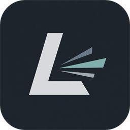

# LeanCast

LeanCast is a lightweight native Windows app launcher. A global shortcut opens a centered search overlay for installed apps and open windows, with real icons, fuzzy search, keyboard-first navigation, and a tray icon.



## Features

- App search across system and per-user Start Menu shortcuts plus AppsFolder entries
- Open-window switching with foreground restore for minimized windows
- Token-aware fuzzy search ranked for launcher usage
- Lazy shell icon loading with a native PNG icon cache
- Keyboard-first controls: Up/Down, Enter, Ctrl+Shift+Enter, Esc
- Configurable global shortcut, default `Alt+Space`
- Compact mode, Windows accent sync, and custom accent color
- Background tray menu: Open LeanCast, Settings, Quit

AI chat and AI provider settings were removed in the native remake.

## Usage

| Action | Key |
| --- | --- |
| Open / close overlay | `Alt+Space` by default |
| Move selection | `Up` / `Down` |
| Launch selected app or focus selected window | `Enter` |
| Launch selected app as administrator | `Ctrl+Shift+Enter` |
| Close overlay | `Esc` |
| Open Settings | Gear button or tray menu |

The tray icon runs in the background. Left-click opens search; right-click opens the menu.

## Development

Prerequisites on Windows:

- Visual Studio 2022 with Desktop development with C++
- CMake 3.22 or newer
- Optional: NSIS if you want the CPack NSIS installer target

```powershell
cmake -S . -B build-native -G "Visual Studio 17 2022" -A x64
cmake --build build-native --config Release
ctest --test-dir build-native -C Release
cpack --config build-native/CPackConfig.cmake -C Release
```

The executable is produced as `build-native/Release/LeanCast.exe` with Visual Studio generators.

## Settings and Cache

Runtime data is stored under `%APPDATA%\LeanCast`:

- `settings.json` stores `shortcut`, `recentApps`, `compactMode`, `syncAccentColor`, and `customAccentColor`
- `icon-cache-native/` stores resolved PNG icons keyed by icon source

Older AI-related fields are ignored and are not written back by the native app.

## Icons

The application icon assets are kept in `build/`. Regenerate them with:

```powershell
powershell -ExecutionPolicy Bypass -File scripts/gen-icons.ps1
```

## Tech

LeanCast is now a Win32 C++23 application rendered with Direct2D/DirectWrite. It uses native Windows APIs for tray integration, shell/app discovery, shortcut parsing, low-level keyboard hooks, window enumeration/focus, and shell icon extraction.

## License

This project is licensed under the MIT License - see the [LICENSE](LICENSE) file for details.
